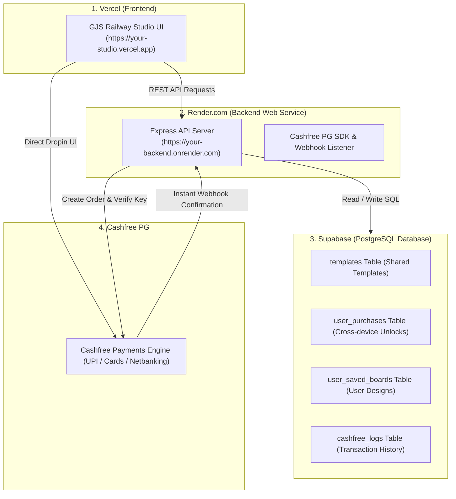

# Complete Setup Guide: Vercel (Frontend) + Render (Backend) + Supabase (Database)

This guide walks you through connecting:
- **Frontend**: Hosted on **Vercel** (Vite + React)
- **Backend**: Hosted on **Render.com** (Node.js + Express API)
- **Database**: Hosted on **Supabase** (Managed PostgreSQL)

---

## 🏗️ Architecture Overview

---

## 🗄️ Step 1: Set Up Supabase Database (100% Free)

1. Go to **[supabase.com](https://supabase.com)** and sign in (or click "Start your project" with GitHub).
2. Click **"New project"**:
   - **Name**: `gjs-railway-studio`
   - **Database Password**: Choose a strong password and save it.
   - **Region**: Select **South Asia (Mumbai)** or **Southeast Asia (Singapore)** for the lowest latency in India.
   - **Pricing Plan**: Free tier ($0/month).
3. Once the database initializes (~1 minute), go to the **SQL Editor** tab (icon with `>_` on the left sidebar).
4. Click **"New query"**, open the file [`server/supabase_schema.sql`](./server/supabase_schema.sql) in this repo, copy its entire contents, paste it into the editor, and click **"Run"** (or press Ctrl+Enter).
   - This creates all 4 tables (`templates`, `user_purchases`, `user_saved_boards`, `cashfree_logs`) and seeds the default Indian Railways LED templates.
5. Retrieve your API credentials:
   - Go to **Project Settings** (gear icon at the bottom left) > **API**.
   - Copy:
     - **Project URL** (e.g. `https://xyzcompany.supabase.co`)
     - **service_role key** (secret key under "Project API keys" — click "Reveal").

---

## 🖥️ Step 2: Deploy Backend to Render.com (Free Web Service)

1. Push your repository to **GitHub**.
2. Go to **[render.com](https://render.com)** and sign up / log in with GitHub.
3. In the Render Dashboard, click **"New +"** > **"Web Service"**.
4. Select **"Build and deploy from a Git repository"** and connect your repo: `GJS-NM-EDITOR`.
5. Configure the Web Service:
   - **Name**: `gjs-railway-backend`
   - **Region**: **Singapore** (Closest to India on Render's free tier).
   - **Branch**: `main`
   - **Root Directory**: `server` ⚠️ *(Important: type `server`)*
   - **Runtime**: `Node`
   - **Build Command**: `npm install`
   - **Start Command**: `npm start`
   - **Instance Type**: `Free` ($0/month).
6. Click **"Advanced"** > **"Add Environment Variable"** and add:

| Key | Value | Description |
| :--- | :--- | :--- |
| `NODE_ENV` | `production` | Production environment |
| `PORT` | `10000` | Internal port |
| `FRONTEND_URL` | `*` *(or your Vercel URL)* | CORS origin |
| `SUPABASE_URL` | `https://xyz.supabase.co` | From Step 1 |
| `SUPABASE_SERVICE_ROLE_KEY` | `eyJ...` | From Step 1 |
| `CASHFREE_APP_ID` | `TEST_CF_APP_GJS_94821` | From Cashfree Dashboard |
| `CASHFREE_SECRET_KEY` | `TEST_CF_SECRET_SECURED` | From Cashfree Dashboard |
| `CASHFREE_ENV` | `sandbox` *(or `production`)* | Cashfree environment |

7. Click **"Create Web Service"**.
8. Render will install dependencies, connect to Supabase, and start the service.
9. When the status changes to **"Live"**, copy your backend URL:
   - Example: `https://gjs-railway-backend.onrender.com`
   - Test it by opening: `https://gjs-railway-backend.onrender.com/health` in your browser. You should see `{"status": "HEALTHY"}`!

---

## 🌐 Step 3: Connect Vercel Frontend to Render Backend

Now link your Vercel frontend to your live Render backend:

1. Open **[vercel.com](https://vercel.com)** and go to your **Project Dashboard**.
2. Go to **Settings > Environment Variables**.
3. Add the following variable:
   - **Key**: `VITE_API_BASE_URL`
   - **Value**: `https://gjs-railway-backend.onrender.com` *(your real Render URL from Step 2)*
4. Go to the **Deployments** tab and click **"Redeploy"** on your latest deployment (or make a small git commit and push).

---

## 🎯 Verification & Testing

1. Open your **Vercel frontend URL** in your browser.
2. Open browser DevTools (F12 > Console / Network):
   - You will see API calls to `https://your-backend.onrender.com/api/templates`.
3. In **Admin Mode**:
   - Create or edit a template and click **"Post Online (Public)"**.
   - Check your **Supabase Dashboard > Table Editor > templates** table — you will see your template stored directly in PostgreSQL!
4. Sign in with Google on device A, buy or unlock a template, and log in on device B — the template will automatically be unlocked on device B too!
5. In **Cashfree Merchant Dashboard**:
   - Set the Webhook URL to: `https://your-backend.onrender.com/api/cashfree/webhook`.
   - Any payment completed by a customer will automatically trigger this webhook and unlock the template in Supabase.

